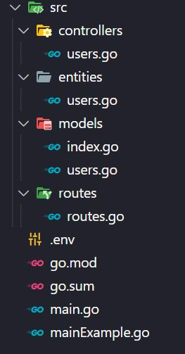

# Go Project Manager

This manager helps you create simple CRUD routes quickly.

# Get Started

To install **gps**, use the following command:

```
go get github.com/lucalves3/gps
```

# Using the commands

```go
	g := gps.CreateStructure{}
	g.CreateAllProjectStructureFolders()
	g.CreateControllerExampleFile("module_name", "entitie_name")
	g.CreateModelExampleFile("module_name", "entitie_name")
	g.CreateEnvFileExample("module_name")
	g.CreateMainFileExample("module_name")
	g.CreateRoutesFileExample("module_name")
```

**module_name**: is the module name in your go.mod

**entitie_name**:is the type struct you will use to refer a gorm model and database schema

This will create the following structure:



And the **mainExample.go** will help you to run your project
